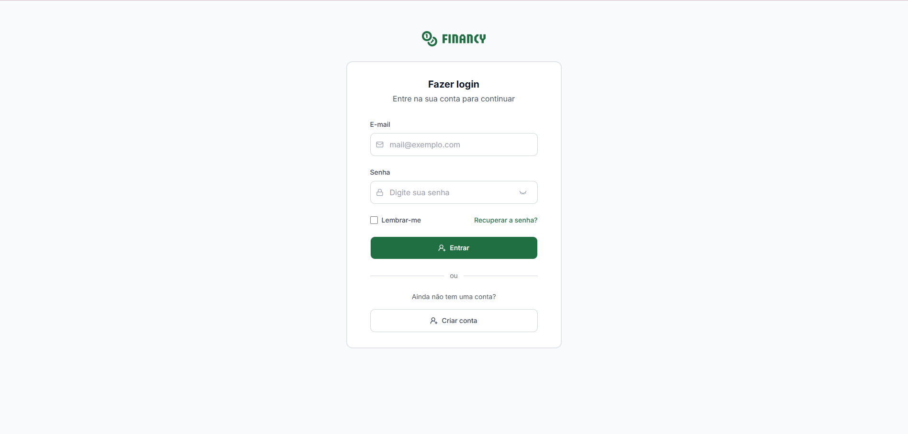
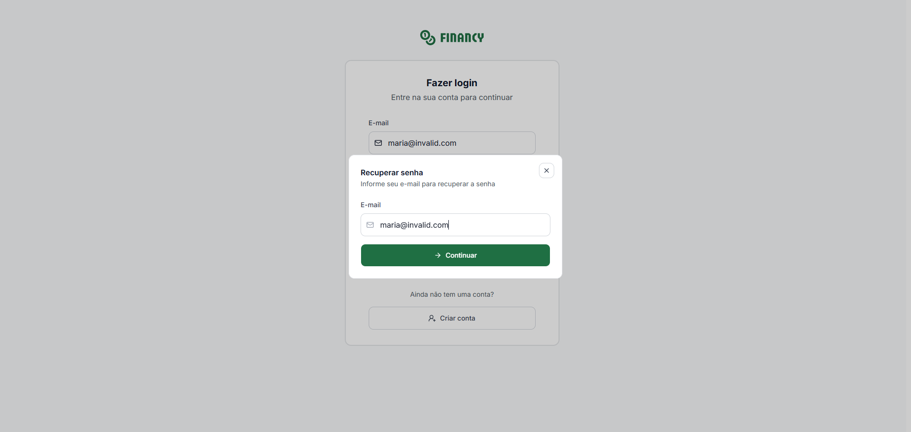
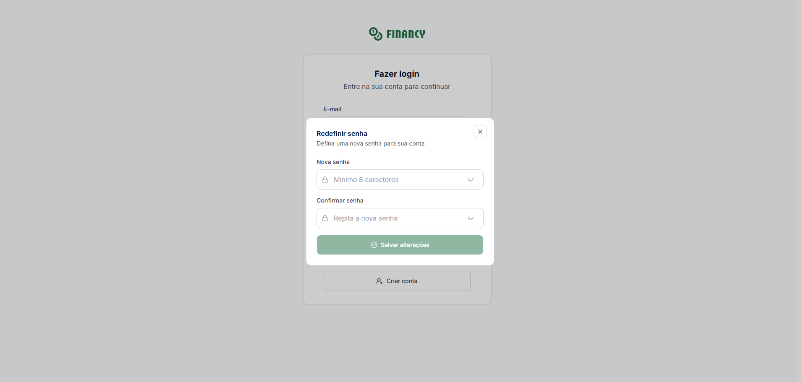
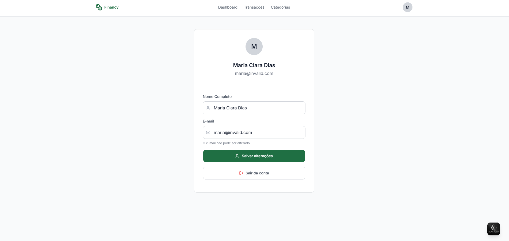
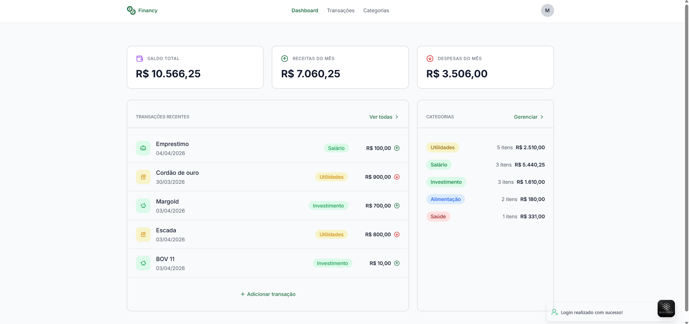
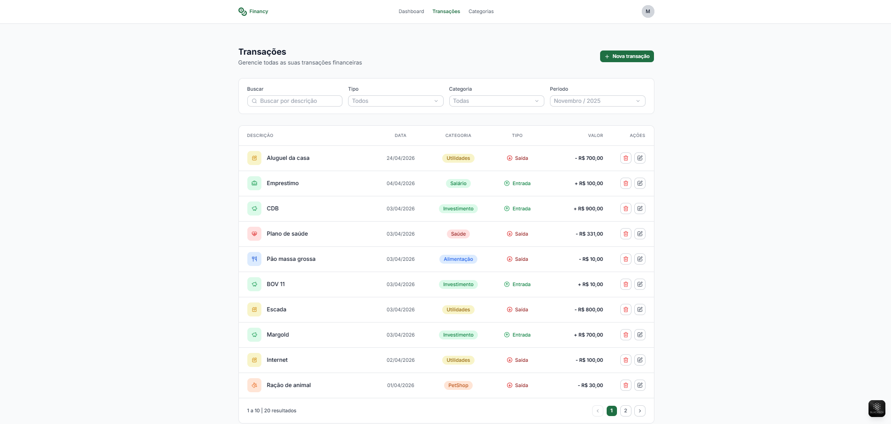
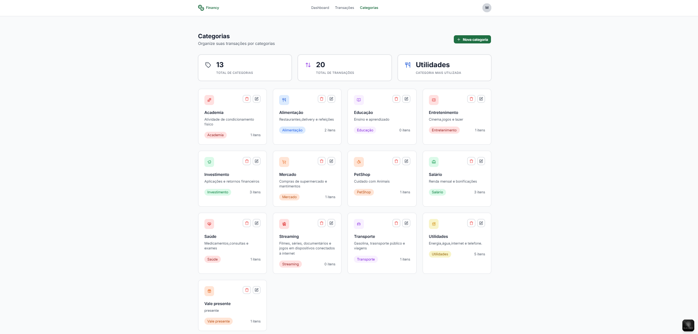

# 💰 Financy

Aplicação FullStack de gerenciamento de finanças pessoais.
Permite organizar receitas, despesas e categorias, com visualização em dashboard.

---

## 🎨 Layout (Figma)

Design baseado no Figma:
https://www.figma.com/community/file/1580994817007013257/financy-

---

## 📸 Preview do Sistema

### 🔐 Autenticação



### 🔐 Recuperar senha




### 👤 Editar perfil



### 📊 Dashboard



### 💸 Transações



### 🏷️ Categorias



---

## 🎥 Demonstração


---

## 🚀 Tecnologias Utilizadas

### 🔧 Backend

* TypeScript
* GraphQL
* Node.js + Express
* Prisma ORM
* SQLite
* JWT
* Bcrypt

### 🎨 Frontend

* TypeScript
* React
* Vite
* Apollo Client
* TailwindCSS
* Shadcn UI
* React Hook Form
* Zustand

---

## 📋 Funcionalidades e Regras

### 🔧 Backend

* [x] O usuário pode criar uma conta e fazer login
* [x] O usuário pode ver e gerenciar apenas seus dados
* [x] Criar, editar, deletar e listar transações
* [x] Criar, editar, deletar e listar categorias

---

### 🎨 Frontend

* [x] Autenticação (login/cadastro)
* [x] Gerenciamento de transações
* [x] Gerenciamento de categorias
* [x] Filtros de transações
* [x] Dashboard com dados financeiros
* [x] Adicionar transação via dashboard

---

### 📌 Regras obrigatórias do desafio

* [x] React com TypeScript
* [x] Vite como bundler
* [x] GraphQL para comunicação
* [x] Fidelidade ao layout do Figma

---

### 🚀 Requisitos adicionais

* [x] Recuperação de senha (backend + frontend)

---

## ⚙️ Como rodar o projeto

### Backend

```bash
cd backend
npm install
npx prisma migrate dev
npm run dev
```

---

### Frontend

```bash
cd frontend
npm install
npm run dev
```

---

## 🧠 Arquitetura

* Backend: regras de negócio + banco de dados
* Frontend: interface e experiência
* Comunicação via GraphQL

---

## ✨ Diferenciais

* Dashboard com agregações (groupBy)
* Organização por camadas
* UI moderna com Tailwind + Shadcn
* Implementação de recuperação de senha

---

## 👩‍💻 Autora

Rosana Oliveira
