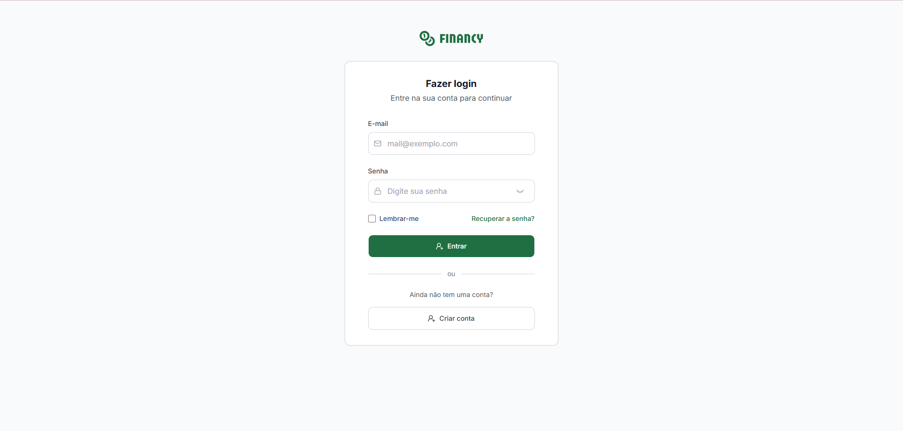
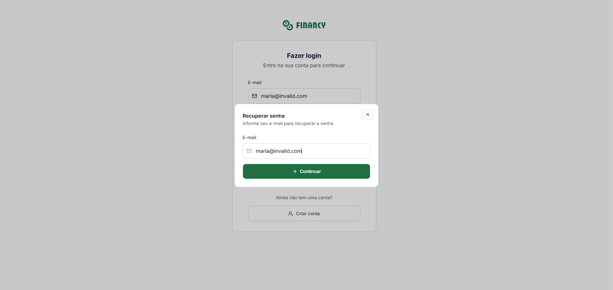
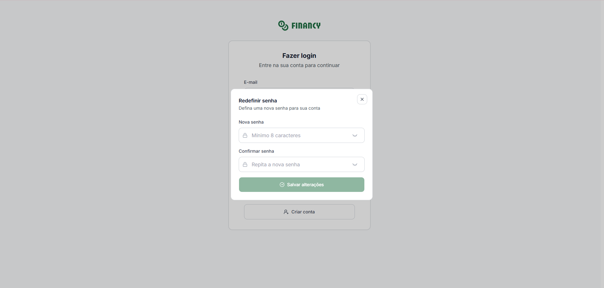
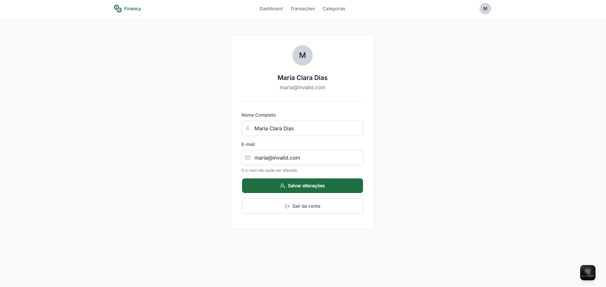
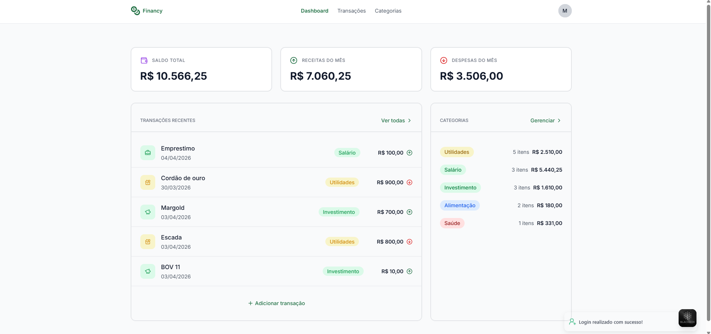
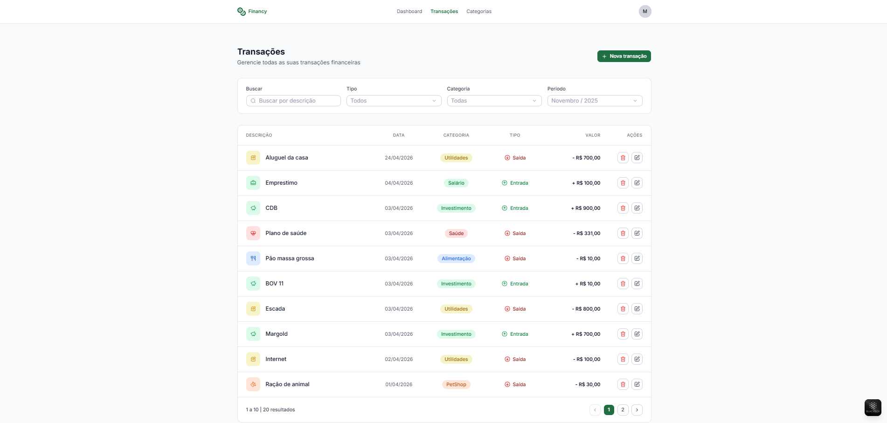
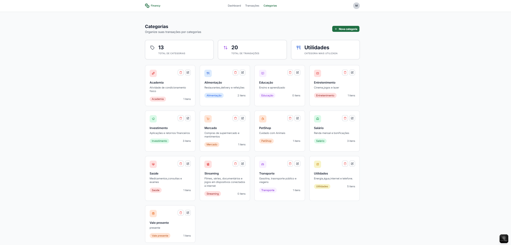

# 💰 Financy

FullStack personal finance management application.  
Allows users to organize income, expenses, and categories, with dashboard visualization.

---

## 🎨 Layout (Figma)

Design based on the Figma file:  
https://www.figma.com/community/file/1580994817007013257/financy-

---

## 📸 System Preview

### 🔐 Authentication



### 🔐 Password Recovery




### 👤 Edit Profile



### 📊 Dashboard



### 💸 Transactions



### 🏷️ Categories



---

## 🎥 Demo


---

## 🚀 Technologies Used

### 🔧 Backend

* TypeScript
* GraphQL
* Node.js + Express
* Prisma ORM
* SQLite
* JWT
* Bcrypt

### 🎨 Frontend

* TypeScript
* React
* Vite
* Apollo Client
* TailwindCSS
* Shadcn UI
* React Hook Form
* Zustand

---

## 📋 Features and Rules

### 🔧 Backend

* [x] Users can create an account and log in
* [x] Users can view and manage only their own data
* [x] Create, edit, delete, and list transactions
* [x] Create, edit, delete, and list categories

---

### 🎨 Frontend

* [x] Authentication (login/sign up)
* [x] Transaction management
* [x] Category management
* [x] Transaction filters
* [x] Dashboard with financial data
* [x] Add transactions directly from the dashboard

---

### 📌 Mandatory Challenge Requirements

* [x] React with TypeScript
* [x] Vite as bundler
* [x] GraphQL for communication
* [x] Fidelity to the Figma design

---

### 🚀 Additional Requirements

* [x] Password recovery (backend + frontend)

---

## ⚙️ How to Run the Project

### Backend

```bash
cd backend
npm install
npx prisma migrate dev
npm run dev
```

---

### Frontend

```bash
cd frontend
npm install
npm run dev
```

---

## 🧠 Architecture

* Backend: business rules + database
* Frontend: interface and user experience
* Communication via GraphQL

---

## ✨ Highlights

* Dashboard with aggregations (groupBy)
* Layered architecture organization
* Modern UI with Tailwind + Shadcn
* Password recovery implementation

---

## 👩‍💻 Author

Rosana Oliveira
